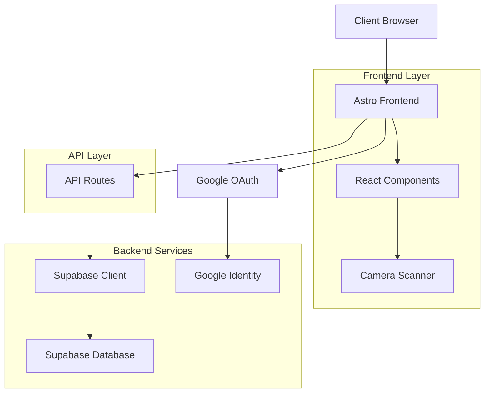

# Design Document

## Overview

The QR Scanner Registry is a modern web application built with Astro 5 and React 19 that provides secure QR/barcode scanning capabilities with Google OAuth authentication and Supabase backend integration. The application follows a hybrid architecture leveraging Astro's static site generation for optimal performance while using React for interactive components.

## Architecture

### High-Level Architecture



### Technology Stack Integration

- **Astro 5**: Server-side rendering and static site generation for optimal performance
- **React 19**: Interactive components for camera scanning and user interface
- **TypeScript**: Type safety across the entire application
- **Supabase**: Authentication, database, and real-time capabilities
- **react-qr-barcode-scanner**: Camera-based QR/barcode scanning
- **Tailwind CSS 4**: Utility-first styling with shadcn/ui components

## Components and Interfaces

### Core Components

#### 1. Authentication Components
- `LoginButton.tsx`: Google OAuth login interface
- `UserProfile.tsx`: Display authenticated user information
- `AuthGuard.tsx`: Route protection wrapper
- `LogoutButton.tsx`: Session termination

#### 2. Scanner Components
- `QRScanner.tsx`: Main scanning interface using react-qr-barcode-scanner
- `ScanResult.tsx`: Display and manage scan results
- `CameraPermissions.tsx`: Handle camera access permissions
- `ScanHistory.tsx`: List and manage previous scans

#### 3. Layout Components
- `MainLayout.astro`: Primary application layout
- `Navigation.tsx`: App navigation with authentication state
- `ErrorBoundary.tsx`: Error handling wrapper

### API Interfaces

#### Authentication Endpoints
```typescript
// /api/auth/google.ts
POST /api/auth/google
- Handles Google OAuth callback
- Creates/updates user in Supabase
- Returns session token

// /api/auth/logout.ts
POST /api/auth/logout
- Terminates user session
- Clears authentication cookies
```

#### Scan Management Endpoints
```typescript
// /api/scans/create.ts
POST /api/scans
- Creates new scan record
- Validates user authentication
- Returns created scan data

// /api/scans/list.ts
GET /api/scans
- Returns user's scan history
- Supports pagination and filtering

// /api/scans/delete.ts
DELETE /api/scans/:id
- Removes scan record
- Validates ownership
```

## Data Models

### Database Schema (Supabase)

#### Users Table
```sql
CREATE TABLE users (
  id UUID PRIMARY KEY DEFAULT gen_random_uuid(),
  google_id VARCHAR UNIQUE NOT NULL,
  email VARCHAR NOT NULL,
  name VARCHAR NOT NULL,
  avatar_url VARCHAR,
  created_at TIMESTAMP WITH TIME ZONE DEFAULT NOW(),
  updated_at TIMESTAMP WITH TIME ZONE DEFAULT NOW()
);
```

#### Scans Table
```sql
CREATE TABLE scans (
  id UUID PRIMARY KEY DEFAULT gen_random_uuid(),
  user_id UUID REFERENCES users(id) ON DELETE CASCADE,
  content TEXT NOT NULL,
  scan_type VARCHAR CHECK (scan_type IN ('qr', 'barcode')),
  format VARCHAR, -- QR format or barcode type
  scanned_at TIMESTAMP WITH TIME ZONE DEFAULT NOW(),
  created_at TIMESTAMP WITH TIME ZONE DEFAULT NOW()
);

CREATE INDEX idx_scans_user_id ON scans(user_id);
CREATE INDEX idx_scans_scanned_at ON scans(scanned_at DESC);
```

### TypeScript Interfaces

```typescript
// src/types.ts
export interface User {
  id: string;
  googleId: string;
  email: string;
  name: string;
  avatarUrl?: string;
  createdAt: string;
  updatedAt: string;
}

export interface Scan {
  id: string;
  userId: string;
  content: string;
  scanType: 'qr' | 'barcode';
  format?: string;
  scannedAt: string;
  createdAt: string;
}

export interface ScanCreateRequest {
  content: string;
  scanType: 'qr' | 'barcode';
  format?: string;
}

export interface AuthSession {
  user: User;
  accessToken: string;
  expiresAt: string;
}
```

## Error Handling

### Client-Side Error Handling
- **Camera Access Errors**: Graceful fallback with clear user instructions
- **Network Errors**: Retry mechanisms with exponential backoff
- **Authentication Errors**: Automatic redirect to login with error context
- **Scan Processing Errors**: User-friendly error messages with retry options

### Server-Side Error Handling
- **Database Connection Errors**: Circuit breaker pattern with health checks
- **Authentication Failures**: Proper HTTP status codes and error responses
- **Validation Errors**: Detailed field-level error messages
- **Rate Limiting**: Implement rate limiting for API endpoints

### Error Logging
- Client errors logged to browser console in development
- Server errors logged with structured logging
- Critical errors reported to monitoring service (future enhancement)

## Testing Strategy

### Unit Testing with Vitest

#### Component Testing
- Test React components in isolation using React Testing Library
- Mock external dependencies (Supabase, camera API)
- Test user interactions and state management
- Verify accessibility compliance

#### Utility Testing
- Test authentication helpers and session management
- Test data validation and transformation functions
- Test API client functions with mocked responses
- Test error handling scenarios

#### API Testing
- Test API routes with mocked Supabase client
- Verify request/response validation
- Test authentication middleware
- Test error handling and edge cases

### End-to-End Testing with Playwright

#### Authentication Flows
- Test Google OAuth login process (mocked)
- Verify session persistence across page reloads
- Test logout functionality
- Test protected route access

#### Scanning Workflows
- Test camera permission handling
- Test QR code scanning with mock camera input
- Test barcode scanning functionality
- Test scan result saving and display
- Test scan history management

#### Cross-Browser Testing
- Test on Chrome, Firefox, and Safari
- Test responsive design on mobile devices
- Test camera functionality on different devices

### Testing Configuration

#### Vitest Setup
```typescript
// vitest.config.ts
export default defineConfig({
  test: {
    environment: 'jsdom',
    setupFiles: ['./src/test/setup.ts'],
    coverage: {
      provider: 'v8',
      reporter: ['text', 'json', 'html'],
      threshold: {
        global: {
          branches: 80,
          functions: 80,
          lines: 80,
          statements: 80
        }
      }
    }
  }
});
```

#### Playwright Configuration
```typescript
// playwright.config.ts
export default defineConfig({
  testDir: './e2e',
  fullyParallel: true,
  forbidOnly: !!process.env.CI,
  retries: process.env.CI ? 2 : 0,
  workers: process.env.CI ? 1 : undefined,
  reporter: 'html',
  use: {
    baseURL: 'http://localhost:4321',
    trace: 'on-first-retry',
  },
  projects: [
    {
      name: 'chromium',
      use: { ...devices['Desktop Chrome'] },
    },
    {
      name: 'firefox',
      use: { ...devices['Desktop Firefox'] },
    },
    {
      name: 'webkit',
      use: { ...devices['Desktop Safari'] },
    },
  ],
});
```

## Security Considerations

### Authentication Security
- Use secure HTTP-only cookies for session management
- Implement CSRF protection for state-changing operations
- Validate Google OAuth tokens server-side
- Use Supabase RLS (Row Level Security) for data access control

### Data Protection
- Encrypt sensitive data at rest in Supabase
- Use HTTPS for all communications
- Implement proper input validation and sanitization
- Follow OWASP security guidelines

### Camera Privacy
- Request explicit camera permissions
- Display clear indicators when camera is active
- Allow users to revoke camera access
- No storage of camera images, only decoded content

## Performance Optimization

### Frontend Performance
- Use Astro's partial hydration for optimal loading
- Implement lazy loading for scanner components
- Optimize bundle size with tree shaking
- Use service workers for offline functionality (future enhancement)

### Backend Performance
- Implement database connection pooling
- Use Supabase's built-in caching mechanisms
- Optimize database queries with proper indexing
- Implement API response caching where appropriate

## Deployment and Infrastructure

### Development Environment
- Local development with Astro dev server
- Local Supabase instance for testing
- Environment variables for configuration

### Production Environment
- Deploy to Vercel or Netlify for optimal Astro performance
- Use Supabase hosted service for production database
- Configure proper environment variables and secrets
- Set up monitoring and logging

## Future Enhancements

### Potential Features
- Bulk scanning capabilities
- Export scan history to CSV/JSON
- Scan categorization and tagging
- Real-time collaboration features
- Mobile app using Capacitor
- Advanced analytics and reporting